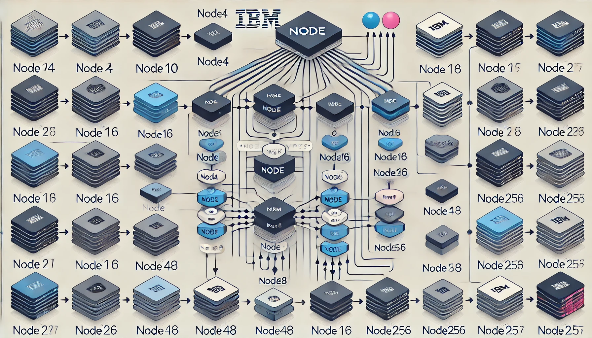

# SubTree - Adaptive Radix Tree (ART) for Subject Matching




This repository implements an **Adaptive Radix Tree (ART)** for efficiently storing and matching subjects. The primary purpose of the tree is to handle subject data that can be filtered using wildcards, which is commonly used in systems like message queues, event processing, and search engines.

The tree structure is optimized for both **memory usage** and **performance** by employing path compression, lazy node expansion, and dynamic node types. The tree adapts to the number of children each node holds, transitioning between different node types (`node4`, `node10`, `node16`, `node48`, `node256`) as needed.

## Key Features

- **Dynamic Node Expansion:** As more children are added, the tree automatically expands to accommodate more nodes, improving memory efficiency.
- **Wildcard Matching:** Supports partial (`*`) and full (`>`) wildcard matching for subjects.
- **Memory Efficiency:** Uses different types of nodes (`node4`, `node10`, `node16`, `node48`, `node256`) to ensure optimal memory usage depending on the number of children.
- **Optimized for Performance:** Efficient matching and retrieval of subjects, ideal for use in high-performance systems.
- **Tree Dumping:** Allows you to dump the tree structure in a human-readable format for debugging.

## Node Types

1. **node4**: Stores up to 4 children, optimized for small sets of children.
2. **node10**: Stores up to 10 children, suitable for numeric keys (0-9).
3. **node16**: Stores up to 16 children.
4. **node48**: Stores up to 48 children.
5. **node256**: Stores up to 256 children, suitable for larger sets of keys.

## How It Works

The `SubjectTree` is built using nodes of varying capacities (`node4`, `node10`, `node16`, etc.), each optimized for different scenarios:

1. **Inserts**: When inserting a subject, the tree dynamically adapts to the number of children. As the number of children grows, the node changes from a `node4` to `node10`, and so on.
2. **Match**: The tree supports both **exact matches** and **wildcard matches**. It can efficiently find all subjects that match a given pattern, even if the pattern contains wildcards (`*` for partial matches and `>` for full matches).
3. **Deletes**: Nodes are also dynamically shrunk when children are deleted, reverting back to smaller nodes like `node10` or `node4`.

### Example of Insertion and Matching

```go
package main

import (
    "fmt"
    "subtree"
)

func main() {
    st := subtree.NewSubjectTree[int]()

    // Insert subjects into the tree
    st.Insert([]byte("foo.bar.baz"), 22)
    st.Insert([]byte("foo.bar.baz.A"), 33)

    // Find exact matches
    value, found := st.Find([]byte("foo.bar.baz"))
    if found {
        fmt.Println("Found value:", value)
    }

    // Match with wildcard
    st.Match([]byte("foo.bar.*"), func(subject []byte, value *int) {
        fmt.Printf("Matching subject: %s with value: %d\n", subject, *value)
    })
}
```

## Tests

### Running Tests

The repository includes a comprehensive set of tests to ensure the correctness and efficiency of the tree operations. To run the tests, use the following command:

```bash
go test -v
```

### Example Tests:

- **Node Prefix Mismatch**: Test case for ensuring proper updates during node splits when prefix mismatches occur.
- **Node Growth**: Test for how the tree grows as more nodes are added, transitioning between different node types.
- **Node Deletion and Shrinking**: Tests the deletion of nodes and how the tree shrinks or consolidates nodes when necessary.
- **Wildcard Matching**: Ensures that partial and full wildcard matching is correctly implemented.

## Performance Considerations

The adaptive nature of the tree ensures that it can efficiently handle a large number of subjects, even when working with millions of entries. The node types (`node4`, `node10`, etc.) ensure that memory usage is optimized, while the wildcard matching system is built for high performance in systems that require fast lookups.

## License

This repository is licensed under the Apache License, Version 2.0. See [LICENSE](LICENSE) for more information.а 